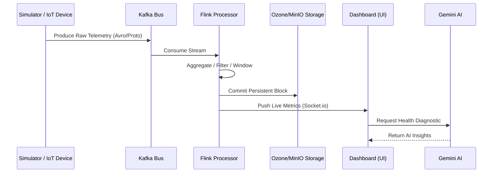

# Vortex Telemetry Hub 🌪️

[](LICENSE)
[](#)
[](#)

Vortex is a high-performance telemetry ingestion pipeline and monitoring dashboard. It simulates a massive-scale data architecture designed for IoT and industrial telemetry, processing hundreds of thousands of events per second with low latency and high reliability.

**Vortex** provides a full-stack simulation of a large-scale telemetry pipeline (ingest → stream → storage → AI diagnostics) so engineering and SRE teams can test scale, diagnose issues, and visualize topology in real time.

---

## 📖 Table of Contents
- [Architecture Overview](#-architecture-overview)
- [Key Features](#-key-features)
- [Tech Stack](#-tech-stack)
- [Getting Started](#-getting-started)
  - [Prerequisites](#prerequisites)
  - [Installation](#installation)
  - [Docker Deployment](#docker-deployment)
- [Running Tests](#-running-tests)
- [Security & Compliance](#-security--compliance)
- [Roadmap](#-roadmap)
- [Contributing](#-contributing)
- [License](#-license)

---

## 🚀 Key Features

- **Real-time Visualization**: Live updates via Socket.io for immediate visibility into pipeline health.
- **AI Diagnostics**: One-click performance analysis using Google Gemini to identify scaling bottlenecks and suggest optimizations.
- **Technical Dashboard**: Industrial-grade UI with high-density metrics, trend analysis, and topological pipeline visualization.
- **Performance Metrics**: Continuous tracking of throughput (OPS/S), end-to-end latency (MS), and Kafka consumer lag.
- **Full-Stack Simulation**: An Express-powered backend that mimics production data flows, backpressure, and failure modes.

---

## 💻 Tech Stack

- **Frontend**: React 19, Tailwind CSS 4, Motion/React, Recharts.
- **Backend**: Node.js (Express), Socket.io for real-time streaming.
- **Stream**: Apache Kafka (simulated in-process or via cluster integration).
- **Processing**: Apache Flink (aggregation and CEP logic).
- **Storage**: Apache Ozone / MinIO (S3-compatible object storage).
- **AI**: Google Generative AI (Gemini 2.0 Flash).

---

## 🏗️ Architecture Overview

The system follows a classic big-data ingestion pattern optimized for high-throughput and fault tolerance:

1.  **Ingestion Layer**: High-velocity sensor data simulators generating thousands of messages/sec.
2.  **Streaming Bus (Kafka)**: Acts as the distributed commit log to decouple ingestion from processing.
3.  **Stream Processing (Flink)**: Real-time windowing and aggregation engine.
4.  **Storage Engine (Ozone/S3)**: High-density object storage for long-term persistence.
5.  **Intelligence Layer (Gemini AI)**: Integrated SRE assistant for automated health diagnostics.

### Event Flow Sequence



---

## 🛠️ Getting Started

### Prerequisites
- **Node.js** (v20+)
- **npm** (or pnpm/yarn)
- **Google AI Studio API Key** (set as `GEMINI_API_KEY`)
- **Docker & Docker Compose** (optional, for full pipeline simulation)

### Installation

1. **Clone the repository**
   ```bash
   git clone https://github.com/msabetta/vortex-telemetry-hub.git
   cd vortex-telemetry-hub
   ```

2. **Install dependencies**
   ```bash
   npm install
   ```

3. **Configure Environment**
   Create a `.env` file in the project root:
   ```env
   GEMINI_API_KEY=your_api_key_here
   NODE_ENV=development
   PORT=3000
   ```

4. **Run Locally**
   ```bash
   npm run dev
   ```
   Open [http://localhost:3000](http://localhost:3000) to view the dashboard.

### Docker Deployment

To run the full stack (Zookeeper, Kafka, MinIO, and Vortex App) in a containerized environment:

```bash
# Set your API key first
export GEMINI_API_KEY=your_key

# Build and start the services
docker-compose up --build
```

### Netlify Deployment

Note: As Netlify is a serverless platform, persistent WebSockets (Socket.io) are not natively supported. To deploy the frontend:
1. Connect your repo to Netlify.
2. Set Build Command: `npm run build`.
3. Set Publish Directory: `dist`.
4. Add `GEMINI_API_KEY` to Site Environment Variables.

---

## 🧪 Running Tests

Vortex uses **Vitest** for unit and integration testing.

```bash
# Run tests once
npm test

# Run tests in watch mode
npm run test:watch

# Generate coverage report
npm run test:coverage
```

---

## 🔒 Security & Compliance

- **Authentication**: Integrated for secure access to the diagnostic hub.
- **Authorization**: Layered RBAC (Role-Based Access Control) simulated for engineering and operations teams.
- **Serialization**: Optimized for network traffic using simulated Avro/Protobuf patterns.

---

## 📈 Roadmap
- Integration with physical IoT gateways via MQTT.
- Predictive failure modeling using historical telemetry trends.
- Kubernetes Operator for automated scaling of Flink task managers.

---

## 🤝 Contributing

1. Fork the repo and create a feature branch (`feature/my-feature`).
2. Run tests and linting locally.
3. Open a PR with a clear description and linked issue.

---

## 📄 License

This project is licensed under the **MIT License** - see the [LICENSE](LICENSE) file for details.

---

*Built with ❤️ by [msabetta](https://github.com/msabetta) for high-performance engineering teams.*